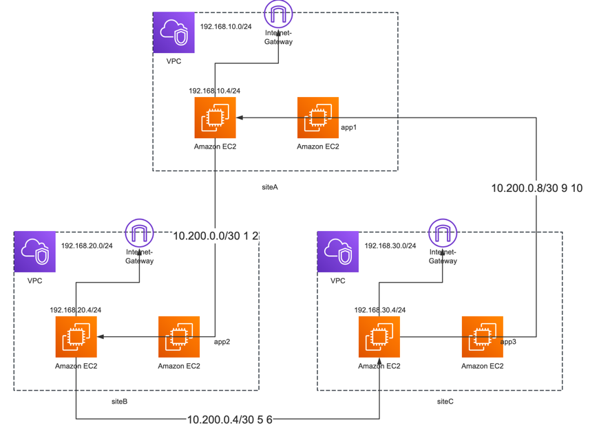

# 搭建一套三站点的vpn网络，使得站点内机器可以互相通信

## 机器分配与网络规划（约定）



总共分配三台主机，分别位于三个子网中，运行openvpn进程，按照ip地址从小到大命名为vpn1、vpn2、vpn3。

| 实例名称 |      所在网段       |     IP地址     |      角色       |
|:----:|:---------------:|:------------:|:-------------:|
| vpn1 | 192.168.10.0/24 | 192.168.10.4 | 1-2客户端、3-1服务器 |
| vpn2 | 192.168.20.0/24 | 192.168.20.4 | 1-2服务器、2-3客户端 |
| vpn3 | 192.168.30.0/24 | 192.168.30.4 | 2-3服务器、3-1客户端 |

在三台主机中间，两两组合成一对，搭建openvpn点对点链路。在每一组中，ip地址小的作为客户端，大的作为服务器，特殊在于vpn3和vpn1链路中，vpn3作为客户端，vpn1作为服务器。

再做一个约定，在使用共享密钥时（--secret），明确指定direction属性，其中客户端使用1，服务器使用0。

|    vpn链路    | 客户端主机 | 服务器主机 |          服务器地址           |     vpn网段     |   客户端侧地址   |   服务器侧地址    |           使用的静态共享密钥           |
|:-----------:|:-----:|:-----:|:------------------------:|:-------------:|:----------:|:-----------:|:-----------------------------:|
| vpn1-vpn2链路 | vpn1  | vpn2  | openvpn2.lgypro.com:1194 | 10.200.0.0/30 | 10.200.0.1 | 10.200.0.2  | secret12.key，在vpn2生成，复制到vpn1上 |
| vpn2-vpn3链路 | vpn2  | vpn3  | openvpn3.lgypro.com:1194 | 10.200.0.4/30 | 10.200.0.5 | 10.200.0.6  | secret23.key，在vpn3生成，复制到vpn2上 |
| vpn3-vpn1链路 | vpn3  | vpn1  | openvpn1.lgypro.com:1194 | 10.200.0.8/30 | 10.200.0.9 | 10.200.0.10 | secret31.key，在vpn1生成，复制到vpn3上 |

## 配置过程

```bash
apt update
apt -y install easy-rsa openvpn
# 启用IP包转发
echo 'net.ipv4.ip_forward=1' >> /etc/sysctl.conf && sysctl -p
```

openvpn软件使用ubuntu的包管理器apt安装，版本是2.5.9

### vpn1-vpn2链路的配置

vpn1作为客户端，vpn2作为服务器

在vpn2上执行

```bash
openvpn --genkey secret secret12.key
```

把共享密钥文件拷贝到/etc/openvpn/server/secret12.key和vpn1上的/etc/openvpn/client/secret12.key

```bash
cat > /etc/openvpn/server/server.conf << 'EOF'
dev tun
proto udp
local 192.168.20.4
port 1194
secret secret12.key 0
ifconfig 10.200.0.2 10.200.0.1
# 到对端网络
route 192.168.10.0 255.255.255.0 vpn_gateway 100
# 经该vpn链路中转，到第三个网络
route 192.168.30.0 255.255.255.0 vpn_gateway 200
user nobody
group nogroup
persist-tun
persist-key
keepalive 10 60
ping-timer-rem
verb 7
EOF
systemctl start openvpn-server@server
systemctl status openvpn-server@server.service
journalctl -u openvpn-server@server.service --no-pager
# workaround，向其余两个网段发送数据包的时候，通过POSTROUTING修改源地址，暂时还没想到其他好方案
iptables -t nat -A POSTROUTING -d 192.168.10.0/24 -s 10.200.0.0/30 -j SNAT --to-source 192.168.20.4
iptables -t nat -A POSTROUTING -d 192.168.30.0/24 -s 10.200.0.0/30 -j SNAT --to-source 192.168.20.4
```

在vpn1上执行

```bash
cat > /etc/openvpn/client/client.conf << 'EOF'
dev tun
proto udp
remote openvpn2.lgypro.com 1194
secret secret12.key 1
ifconfig 10.200.0.1 10.200.0.2
# 到对端网络
route 192.168.20.0 255.255.255.0 vpn_gateway 100
# 经该vpn链路中转，到第三个网络
route 192.168.30.0 255.255.255.0 vpn_gateway 200
user nobody
group nogroup
persist-tun
persist-key
keepalive 10 60
ping-timer-rem
verb 7
EOF
systemctl start openvpn-client@client
systemctl status openvpn-client@client
journalctl -u openvpn-client@client --no-pager
# workaround，向其余两个网段发送数据包的时候，通过POSTROUTING修改源地址，暂时还没想到其他好方案
iptables -t nat -A POSTROUTING -d 192.168.20.0/24 -s 10.200.0.0/30 -j SNAT --to-source 192.168.10.4
iptables -t nat -A POSTROUTING -d 192.168.30.0/24 -s 10.200.0.0/30 -j SNAT --to-source 192.168.10.4
```

### vpn2-vpn3链路的配置

vpn2作为客户端，vpn3作为服务器

在vpn3上执行

```bash
openvpn --genkey secret secret23.key
```

把共享密钥文件拷贝到/etc/openvpn/server/secret23.key和vpn2上的/etc/openvpn/client/secret23.key

```bash
cat > /etc/openvpn/server/server.conf << 'EOF'
dev tun
proto udp
local 192.168.30.4
port 1194
secret secret23.key 0
ifconfig 10.200.0.6 10.200.0.5
# 到对端网络
route 192.168.20.0 255.255.255.0 vpn_gateway 100
# 经该vpn链路中转，到第三个网络
route 192.168.10.0 255.255.255.0 vpn_gateway 200
user nobody
group nogroup
persist-tun
persist-key
keepalive 10 60
ping-timer-rem
verb 7
EOF
systemctl start openvpn-server@server
systemctl status openvpn-server@server.service
journalctl -u openvpn-server@server.service --no-pager
# workaround，向其余两个网段发送数据包的时候，通过POSTROUTING修改源地址，暂时还没想到其他好方案
iptables -t nat -A POSTROUTING -d 192.168.20.0/24 -s 10.200.0.4/30 -j SNAT --to-source 192.168.30.4
iptables -t nat -A POSTROUTING -d 192.168.10.0/24 -s 10.200.0.4/30 -j SNAT --to-source 192.168.30.4
```

在vpn2上执行

```bash
cat > /etc/openvpn/client/client.conf << 'EOF'
dev tun
proto udp
remote openvpn3.lgypro.com 1194
secret secret23.key 1
ifconfig 10.200.0.5 10.200.0.6
# 到对端网络
route 192.168.30.0 255.255.255.0 vpn_gateway 100
# 经该vpn链路中转，到第三个网络
route 192.168.10.0 255.255.255.0 vpn_gateway 200
user nobody
group nogroup
persist-tun
persist-key
keepalive 10 60
ping-timer-rem
verb 7
EOF
systemctl start openvpn-client@client
systemctl status openvpn-client@client
journalctl -u openvpn-client@client --no-pager
# workaround，向其余两个网段发送数据包的时候，通过POSTROUTING修改源地址，暂时还没想到其他好方案
iptables -t nat -A POSTROUTING -d 192.168.30.0/24 -s 10.200.0.4/30 -j SNAT --to-source 192.168.20.4
iptables -t nat -A POSTROUTING -d 192.168.10.0/24 -s 10.200.0.4/30 -j SNAT --to-source 192.168.20.4
```

### vpn3-vpn1链路的配置

vpn3作为客户端，vpn1作为服务器

在vpn1上执行

```bash
openvpn --genkey secret secret31.key
```

把共享密钥文件拷贝到/etc/openvpn/server/secret31.key和vpn3上的/etc/openvpn/client/secret31.key

```bash
cat > /etc/openvpn/server/server.conf << 'EOF'
dev tun
proto udp
local 192.168.10.4
port 1194
secret secret31.key 0
ifconfig 10.200.0.10 10.200.0.9
# 到对端网络
route 192.168.30.0 255.255.255.0 vpn_gateway 100
# 经该vpn链路中转，到第三个网络
route 192.168.20.0 255.255.255.0 vpn_gateway 200
user nobody
group nogroup
persist-tun
persist-key
keepalive 10 60
ping-timer-rem
verb 7
EOF
systemctl start openvpn-server@server
systemctl status openvpn-server@server.service
journalctl -u openvpn-server@server.service --no-pager
# workaround，向其余两个网段发送数据包的时候，通过POSTROUTING修改源地址，暂时还没想到其他好方案
iptables -t nat -A POSTROUTING -d 192.168.30.0/24 -s 10.200.8.0/30 -j SNAT --to-source 192.168.10.4
iptables -t nat -A POSTROUTING -d 192.168.20.0/24 -s 10.200.8.0/30 -j SNAT --to-source 192.168.10.4
```

在vpn3上执行

```bash
cat > /etc/openvpn/client/client.conf << 'EOF'
dev tun
proto udp
remote openvpn1.lgypro.com 1194
secret secret31.key 1
ifconfig 10.200.0.9 10.200.0.10
# 到对端网络
route 192.168.10.0 255.255.255.0 vpn_gateway 100
# 经该vpn链路中转，到第三个网络
route 192.168.20.0 255.255.255.0 vpn_gateway 200
user nobody
group nogroup
persist-tun
persist-key
keepalive 10 60
ping-timer-rem
verb 7
EOF
systemctl start openvpn-client@client
systemctl status openvpn-client@client
journalctl -u openvpn-client@client --no-pager
# workaround，向其余两个网段发送数据包的时候，通过POSTROUTING修改源地址，暂时还没想到其他好方案
iptables -t nat -A POSTROUTING -d 192.168.10.0/24 -s 10.200.0.8/30 -j SNAT --to-source 192.168.30.4
iptables -t nat -A POSTROUTING -d 192.168.20.0/24 -s 10.200.0.8/30 -j SNAT --to-source 192.168.30.4
```

## 验证

每台实例上都运行有两个openvpn进程，一个工作在客户端模式，一个工作在服务器模式

```log
root@vpn1:~# ps aux | grep openvpn
nobody      3073  0.0  0.8  13144  8448 ?        Ss   08:22   0:00 /usr/sbin/openvpn --suppress-timestamps --nobind --config client.conf
nobody      3198  0.0  0.8  13060  8448 ?        Ss   08:40   0:00 /usr/sbin/openvpn --status /run/openvpn-server/status-server.log --status-version 2 --suppress-timestamps --config server.conf
root        3228  0.0  0.2   7004  2304 pts/1    S+   08:44   0:00 grep --color=auto openvpn
```

每台实例都有两个隧道网卡

```log
root@vpn1:~# ip a
1: lo: <LOOPBACK,UP,LOWER_UP> mtu 65536 qdisc noqueue state UNKNOWN group default qlen 1000
    link/loopback 00:00:00:00:00:00 brd 00:00:00:00:00:00
    inet 127.0.0.1/8 scope host lo
       valid_lft forever preferred_lft forever
    inet6 ::1/128 scope host 
       valid_lft forever preferred_lft forever
2: eth0: <BROADCAST,MULTICAST,UP,LOWER_UP> mtu 9001 qdisc fq_codel state UP group default qlen 1000
    link/ether 0a:47:52:55:d9:22 brd ff:ff:ff:ff:ff:ff
    inet 192.168.10.4/24 metric 100 brd 192.168.10.255 scope global dynamic eth0
       valid_lft 2322sec preferred_lft 2322sec
    inet6 fe80::847:52ff:fe55:d922/64 scope link 
       valid_lft forever preferred_lft forever
3: tun0: <POINTOPOINT,MULTICAST,NOARP,UP,LOWER_UP> mtu 1500 qdisc fq_codel state UNKNOWN group default qlen 500
    link/none 
    inet 10.200.0.1 peer 10.200.0.2/32 scope global tun0
       valid_lft forever preferred_lft forever
    inet6 fe80::517:6013:89e2:1ab9/64 scope link stable-privacy 
       valid_lft forever preferred_lft forever
4: tun1: <POINTOPOINT,MULTICAST,NOARP,UP,LOWER_UP> mtu 1500 qdisc fq_codel state UNKNOWN group default qlen 500
    link/none 
    inet 10.200.0.10 peer 10.200.0.9/32 scope global tun1
       valid_lft forever preferred_lft forever
    inet6 fe80::9b05:bee8:fc25:8181/64 scope link stable-privacy 
       valid_lft forever preferred_lft forever
 
root@vpn2:~# ip a
1: lo: <LOOPBACK,UP,LOWER_UP> mtu 65536 qdisc noqueue state UNKNOWN group default qlen 1000
    link/loopback 00:00:00:00:00:00 brd 00:00:00:00:00:00
    inet 127.0.0.1/8 scope host lo
       valid_lft forever preferred_lft forever
    inet6 ::1/128 scope host 
       valid_lft forever preferred_lft forever
2: eth0: <BROADCAST,MULTICAST,UP,LOWER_UP> mtu 9001 qdisc fq_codel state UP group default qlen 1000
    link/ether 0a:21:e3:14:e1:24 brd ff:ff:ff:ff:ff:ff
    inet 192.168.20.4/24 metric 100 brd 192.168.20.255 scope global dynamic eth0
       valid_lft 2302sec preferred_lft 2302sec
    inet6 fe80::821:e3ff:fe14:e124/64 scope link 
       valid_lft forever preferred_lft forever
3: tun0: <POINTOPOINT,MULTICAST,NOARP,UP,LOWER_UP> mtu 1500 qdisc fq_codel state UNKNOWN group default qlen 500
    link/none 
    inet 10.200.0.2 peer 10.200.0.1/32 scope global tun0
       valid_lft forever preferred_lft forever
    inet6 fe80::cea:44b0:a4dd:c2b3/64 scope link stable-privacy 
       valid_lft forever preferred_lft forever
4: tun1: <POINTOPOINT,MULTICAST,NOARP,UP,LOWER_UP> mtu 1500 qdisc fq_codel state UNKNOWN group default qlen 500
    link/none 
    inet 10.200.0.5 peer 10.200.0.6/32 scope global tun1
       valid_lft forever preferred_lft forever
    inet6 fe80::2053:a191:7f01:2947/64 scope link stable-privacy 
       valid_lft forever preferred_lft forever      

root@vpn3:~# ip a
1: lo: <LOOPBACK,UP,LOWER_UP> mtu 65536 qdisc noqueue state UNKNOWN group default qlen 1000
    link/loopback 00:00:00:00:00:00 brd 00:00:00:00:00:00
    inet 127.0.0.1/8 scope host lo
       valid_lft forever preferred_lft forever
    inet6 ::1/128 scope host 
       valid_lft forever preferred_lft forever
2: eth0: <BROADCAST,MULTICAST,UP,LOWER_UP> mtu 9001 qdisc fq_codel state UP group default qlen 1000
    link/ether 0a:84:d0:32:4e:46 brd ff:ff:ff:ff:ff:ff
    inet 192.168.30.4/24 metric 100 brd 192.168.30.255 scope global dynamic eth0
       valid_lft 2280sec preferred_lft 2280sec
    inet6 fe80::884:d0ff:fe32:4e46/64 scope link 
       valid_lft forever preferred_lft forever
3: tun0: <POINTOPOINT,MULTICAST,NOARP,UP,LOWER_UP> mtu 1500 qdisc fq_codel state UNKNOWN group default qlen 500
    link/none 
    inet 10.200.0.6 peer 10.200.0.5/32 scope global tun0
       valid_lft forever preferred_lft forever
    inet6 fe80::f4e8:234a:eee4:e216/64 scope link stable-privacy 
       valid_lft forever preferred_lft forever
4: tun1: <POINTOPOINT,MULTICAST,NOARP,UP,LOWER_UP> mtu 1500 qdisc fq_codel state UNKNOWN group default qlen 500
    link/none 
    inet 10.200.0.9 peer 10.200.0.10/32 scope global tun1
       valid_lft forever preferred_lft forever
    inet6 fe80::2c53:308b:8cd1:a7aa/64 scope link stable-privacy 
       valid_lft forever preferred_lft forever      
```

每台实例都有到其他网段的路由规则

```log
root@vpn1:~# ip route
default via 192.168.10.1 dev eth0 proto dhcp src 192.168.10.4 metric 100 
10.200.0.2 dev tun0 proto kernel scope link src 10.200.0.1 
10.200.0.9 dev tun1 proto kernel scope link src 10.200.0.10 
192.168.10.0/24 dev eth0 proto kernel scope link src 192.168.10.4 metric 100 
192.168.10.1 dev eth0 proto dhcp scope link src 192.168.10.4 metric 100 
192.168.10.2 dev eth0 proto dhcp scope link src 192.168.10.4 metric 100 
192.168.20.0/24 via 10.200.0.2 dev tun0 metric 100 
192.168.20.0/24 via 10.200.0.9 dev tun1 metric 200 
192.168.30.0/24 via 10.200.0.9 dev tun1 metric 100 
192.168.30.0/24 via 10.200.0.2 dev tun0 metric 200

root@vpn2:~# ip route
default via 192.168.20.1 dev eth0 proto dhcp src 192.168.20.4 metric 100 
10.200.0.1 dev tun0 proto kernel scope link src 10.200.0.2 
10.200.0.6 dev tun1 proto kernel scope link src 10.200.0.5 
192.168.10.0/24 via 10.200.0.1 dev tun0 metric 100 
192.168.10.0/24 via 10.200.0.6 dev tun1 metric 200 
192.168.20.0/24 dev eth0 proto kernel scope link src 192.168.20.4 metric 100 
192.168.20.1 dev eth0 proto dhcp scope link src 192.168.20.4 metric 100 
192.168.20.2 dev eth0 proto dhcp scope link src 192.168.20.4 metric 100 
192.168.30.0/24 via 10.200.0.6 dev tun1 metric 100 
192.168.30.0/24 via 10.200.0.1 dev tun0 metric 200

root@vpn3:~# ip route
default via 192.168.30.1 dev eth0 proto dhcp src 192.168.30.4 metric 100 
10.200.0.5 dev tun0 proto kernel scope link src 10.200.0.6 
10.200.0.10 dev tun1 proto kernel scope link src 10.200.0.9 
192.168.10.0/24 via 10.200.0.10 dev tun1 metric 100 
192.168.10.0/24 via 10.200.0.5 dev tun0 metric 200 
192.168.20.0/24 via 10.200.0.5 dev tun0 metric 100 
192.168.20.0/24 via 10.200.0.10 dev tun1 metric 200 
192.168.30.0/24 dev eth0 proto kernel scope link src 192.168.30.4 metric 100 
192.168.30.1 dev eth0 proto dhcp scope link src 192.168.30.4 metric 100 
192.168.30.2 dev eth0 proto dhcp scope link src 192.168.30.4 metric 100 
```

每台实例都有修改源IP地址的iptables规则

```log
root@vpn1:~# iptables -t nat -vnL
Chain PREROUTING (policy ACCEPT 0 packets, 0 bytes)
 pkts bytes target     prot opt in     out     source               destination         

Chain INPUT (policy ACCEPT 0 packets, 0 bytes)
 pkts bytes target     prot opt in     out     source               destination         

Chain OUTPUT (policy ACCEPT 0 packets, 0 bytes)
 pkts bytes target     prot opt in     out     source               destination         

Chain POSTROUTING (policy ACCEPT 0 packets, 0 bytes)
 pkts bytes target     prot opt in     out     source               destination         
    2   168 SNAT       all  --  *      *       10.200.0.0/30        192.168.20.0/24      to:192.168.10.4
    1    84 SNAT       all  --  *      *       10.200.0.0/30        192.168.30.0/24      to:192.168.10.4
    0     0 SNAT       all  --  *      *       10.200.8.0/30        192.168.30.0/24      to:192.168.10.4
    0     0 SNAT       all  --  *      *       10.200.8.0/30        192.168.20.0/24      to:192.168.10.4
 
root@vpn2:~# iptables -t nat -vnL
Chain PREROUTING (policy ACCEPT 0 packets, 0 bytes)
 pkts bytes target     prot opt in     out     source               destination         

Chain INPUT (policy ACCEPT 0 packets, 0 bytes)
 pkts bytes target     prot opt in     out     source               destination         

Chain OUTPUT (policy ACCEPT 0 packets, 0 bytes)
 pkts bytes target     prot opt in     out     source               destination         

Chain POSTROUTING (policy ACCEPT 0 packets, 0 bytes)
 pkts bytes target     prot opt in     out     source               destination         
    2   168 SNAT       all  --  *      *       10.200.0.0/30        192.168.10.0/24      to:192.168.20.4
    0     0 SNAT       all  --  *      *       10.200.0.0/30        192.168.30.0/24      to:192.168.20.4
    1    84 SNAT       all  --  *      *       10.200.0.4/30        192.168.30.0/24      to:192.168.20.4
    0     0 SNAT       all  --  *      *       10.200.0.4/30        192.168.10.0/24      to:192.168.20.4   
 
root@vpn3:~# iptables -t nat -vnL
Chain PREROUTING (policy ACCEPT 0 packets, 0 bytes)
 pkts bytes target     prot opt in     out     source               destination         

Chain INPUT (policy ACCEPT 0 packets, 0 bytes)
 pkts bytes target     prot opt in     out     source               destination         

Chain OUTPUT (policy ACCEPT 0 packets, 0 bytes)
 pkts bytes target     prot opt in     out     source               destination         

Chain POSTROUTING (policy ACCEPT 0 packets, 0 bytes)
 pkts bytes target     prot opt in     out     source               destination         
    2   168 SNAT       all  --  *      *       10.200.0.4/30        192.168.20.0/24      to:192.168.30.4
    1    84 SNAT       all  --  *      *       10.200.0.4/30        192.168.10.0/24      to:192.168.30.4
    0     0 SNAT       all  --  *      *       10.200.0.8/30        192.168.10.0/24      to:192.168.30.4
    0     0 SNAT       all  --  *      *       10.200.0.8/30        192.168.20.0/24      to:192.168.30.4   
```
